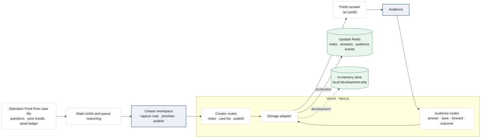
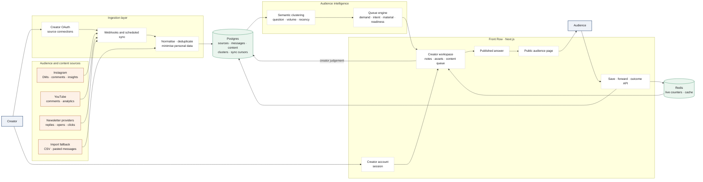

# Front Row

Front Row helps creators turn repeated audience questions and first-hand insights into an evidence-backed content queue, one trusted answer and a measurable next step.

## Product loop

1. The creator captures the insight, cost and material from a room.
2. Front Row connects that note to repeated audience questions and existing material.
3. The content queue explains what to publish next and what to acknowledge without creating individual reply work.
4. The creator publishes their judgement and one next step.
5. The shared answer records genuine saves, forwards and reported outcomes.

## Demo case

The included demo applies this product loop to Aditi's Operation Front Row case. The creator workspace speaks directly to the signed-in creator as "you"; the audience view presents that creator's published judgement.

Historical case evidence and live product activity remain separate.

## Architecture

### Current judged demo

The current build proves the creator loop against a fixed case file. It does not claim live platform ingestion.



### Target product architecture

<p align="center">
  &nbsp;&nbsp;<strong>Instagram</strong>&nbsp;&nbsp;&nbsp;&nbsp;
  &nbsp;&nbsp;<strong>YouTube</strong>&nbsp;&nbsp;&nbsp;&nbsp;
  <span aria-label="Newsletter">✉️</span>&nbsp;&nbsp;<strong>Newsletter providers</strong>
</p>



The target diagram is the intended product, not a claim about the current build. Direct connectors require creator consent, provider permissions, sync cursors and deduplication. Import remains the fallback when a platform does not expose the required messages or analytics.

## Local development

```bash
npm install
npm run dev
```

Without Upstash variables, development uses an in-memory store that resets with the server. Production deliberately fails storage requests when Upstash is missing rather than silently losing audience activity.

To exercise a production build locally without Upstash, start it with `FRONT_ROW_LOCAL_STORE=1`. Do not set that flag on the deployed app.

## Production configuration

Set the variables listed in `.env.example`:

- `UPSTASH_REDIS_REST_URL`
- `UPSTASH_REDIS_REST_TOKEN`

The judged demo is intentionally public. Anyone with the deployment URL can save notes and publish answers.

Then build and start:

```bash
npm run build
npm run start
```

The intended deployment is Vercel with Upstash Redis. The audience answer routes and API handlers require a Next.js runtime, so this is not a static export.

## Checks

```bash
npm run lint
npm test
npx tsc --noEmit
npm run build
```
